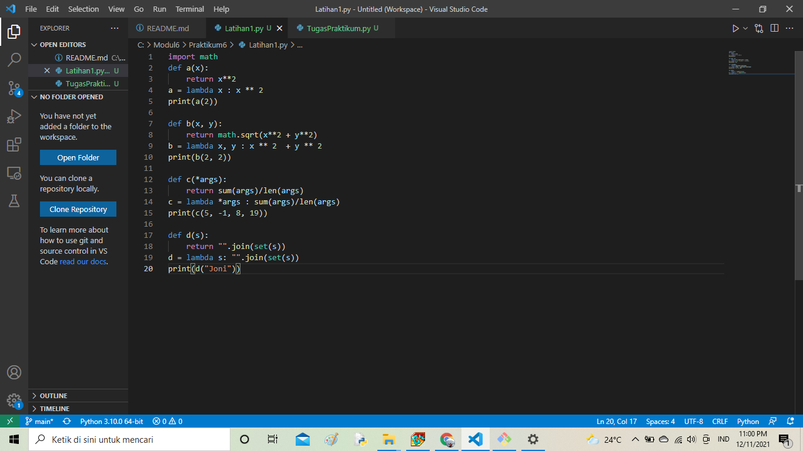
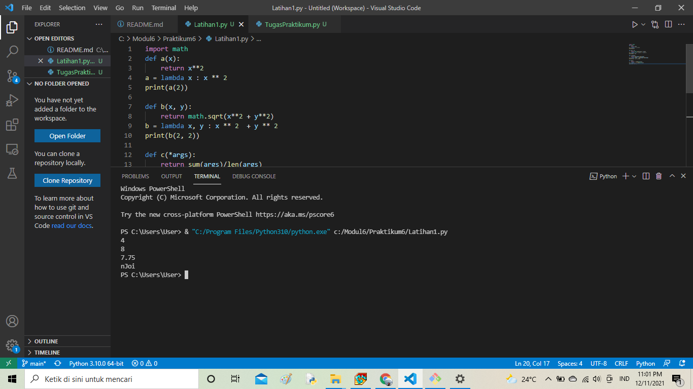
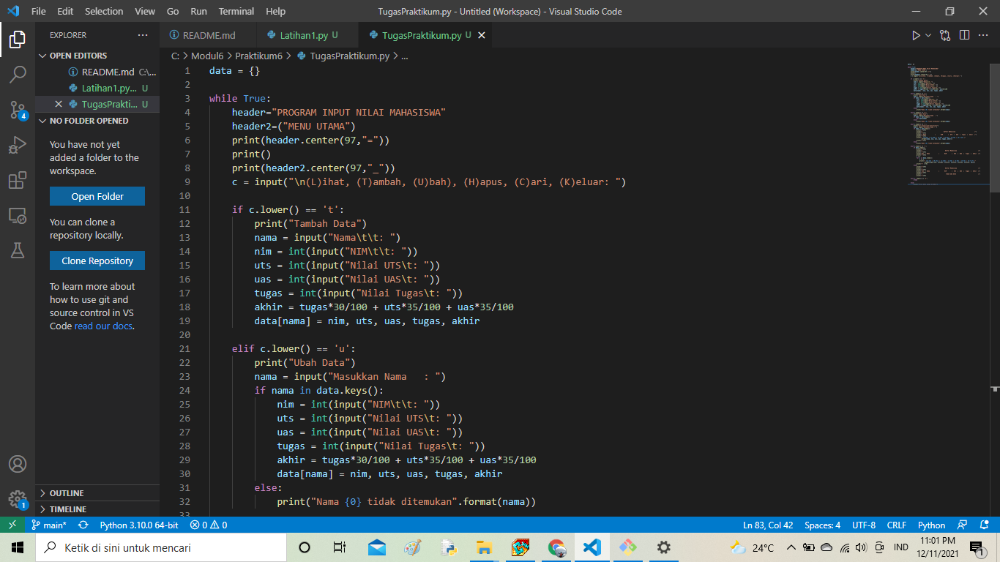
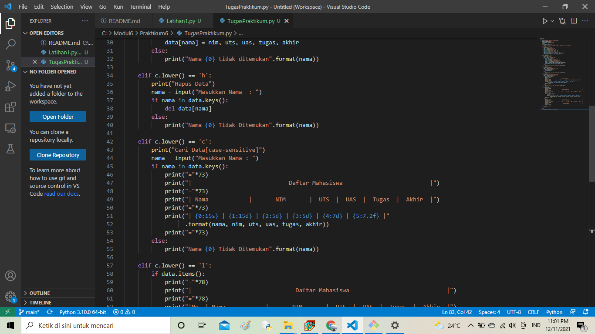
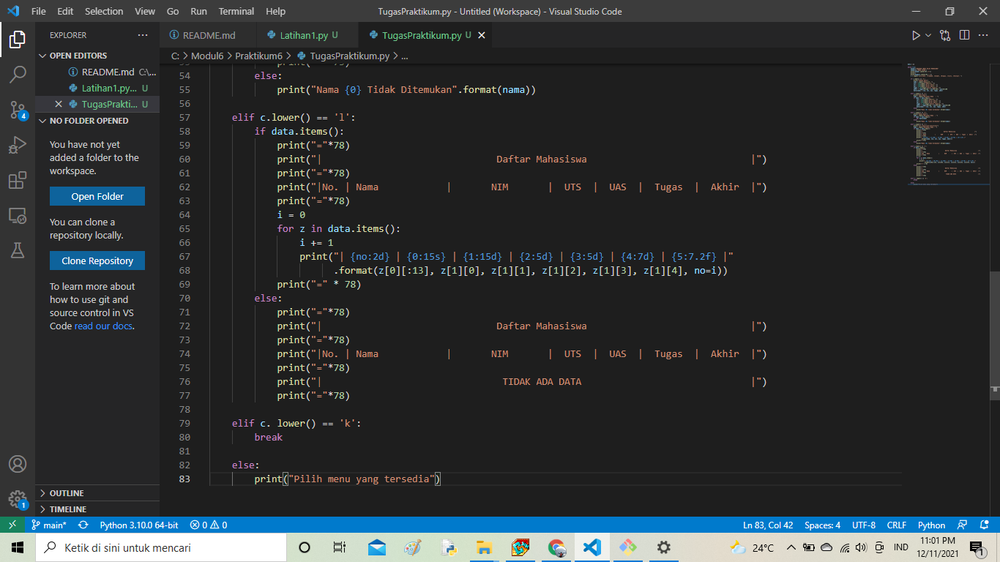
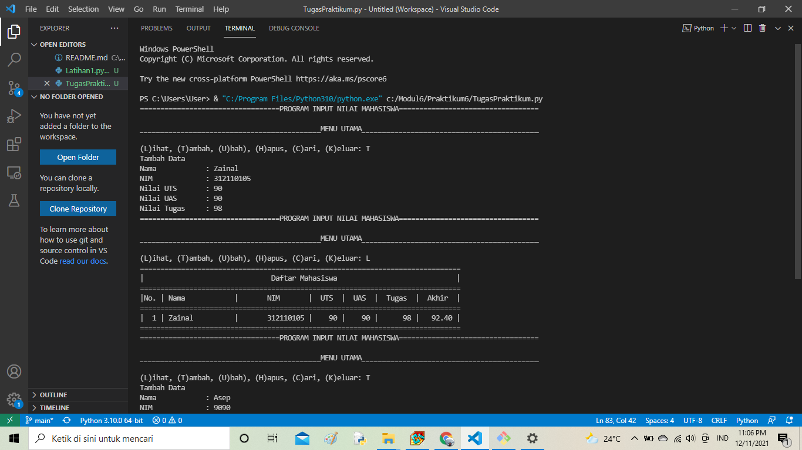
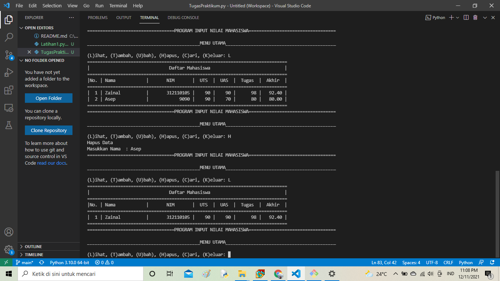
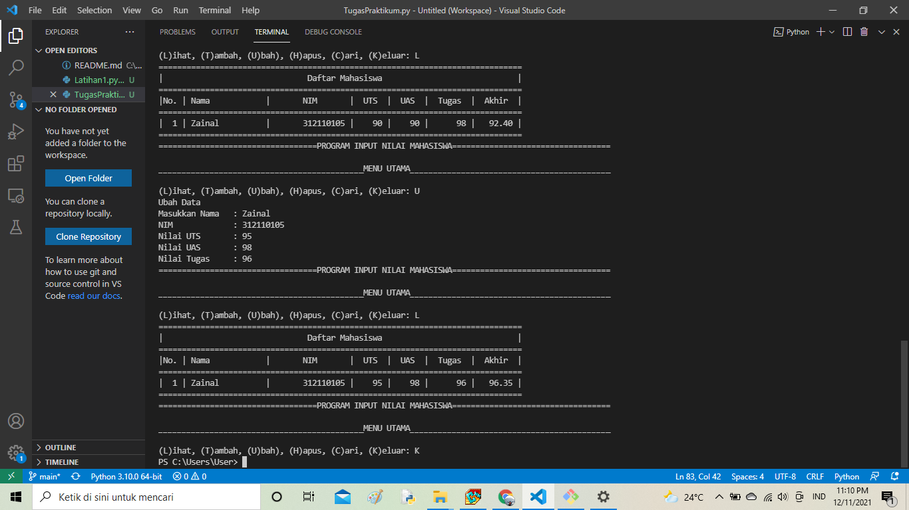
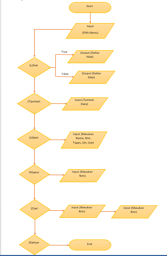

# Praktikum6

Nama : Zainal Abidin

Kelas : TI 21 C1

NIM : 312110105

# Latihan 1 fungsi menggunakan lambda

Codingan

# Penjelasan

Untuk memperluas daftar fungsi matematika digunakan import math

Fungsi lambda yang menggunakan variabel ad

import math
def a(x):
    return x**2
a = lambda x : x ** 2
print(a(2))

def b(x, y):
    return math.sqrt(x**2 + y**2)
b = lambda x, y : x ** 2  + y ** 2
print(b(2, 2))

def c(*args):
    return sum(args)/len(args)
c = lambda *args : sum(args)/len(args)
print(c(5, -1, 8, 19))

def d(s):
    return "".join(set(s))
d = lambda s: "".join(set(s))
print(d("Joni"))

# Keluaran 

# TugasPraktikum 

Buat program sederhana dengan menerapkan nilai penggunaan fungsi yang akan menampilkan daftar mahasiswa, dengan ketentuan:

Fungsi tambah() untuk menambah data

Fungsi tampilkan() untuk menampilkan data

Fungsi hapus(nama) untuk menghapus data berdasarkan nama

Fungsi ubah(nama) untuk mengubah data berdasarkan nama

Buatlah flowchart dan penjelasan programnya pada README.md

# Codingan 

# Penjelasan

Buatlah kamus yang akan diinput dengan data

data = {}

Membuat perulangan dan keterangan untuk pilihan menu

while True:
    header="PROGRAM INPUT NILAI MAHASISWA"
    header2=("MENU UTAMA")
    print(header.center(97,"="))
    print()
    print(header2.center(97,"_"))
    c = input("\n(L)ihat, (T)ambah, (U)bah), (H)apus, (C)ari, (K)eluar: ")

menambahkan data yang akan diinput kemudian masuk ke dalam kamus

if c.lower() == 't':
        print("Tambah Data")
        nama = input("Nama\t\t: ")
        nim = int(input("NIM\t\t: "))
        uts = int(input("Nilai UTS\t: "))
        uas = int(input("Nilai UAS\t: "))
        tugas = int(input("Nilai Tugas\t: "))
        akhir = tugas*30/100 + uts*35/100 + uas*35/100
        data[nama] = nim, uts, uas, tugas, akhir

# Output pengeluaran

Jika ingin menampilkan data dapat menggunakan

elif c.lower() == 'l':
        if data.items():
            print("="*78)
            print("|                               Daftar Mahasiswa                             |")
            print("="*78)
            print("|No. | Nama            |       NIM       |  UTS  |  UAS  |  Tugas  |  Akhir  |")
            print("="*78)
            i = 0
            for z in data.items():
                i += 1
                print("| {no:2d} | {0:15s} | {1:15d} | {2:5d} | {3:5d} | {4:7d} | {5:7.2f} |"
                      .format(z[0][:13], z[1][0], z[1][1], z[1][2], z[1][3], z[1][4], no=i))
            print("=" * 78)
        else:
            print("="*78)
            print("|                               Daftar Mahasiswa                             |")
            print("="*78)
            print("|No. | Nama            |       NIM       |  UTS  |  UAS  |  Tugas  |  Akhir  |")
            print("="*78)
            print("|                                TIDAK ADA DATA                              |")
            print("="*78)

Menghapus data dapat menggunakan

 elif c.lower() == 'h':
        print("Hapus Data")
        nama = input("Masukkan Nama  : ")
        if nama in data.keys():
            del data[nama]
        else:
            print("Nama {0} Tidak Ditemukan".format(nama))

Mengubah data dapat menggunakan

elif c.lower() == 'u':
        print("Ubah Data")
        nama = input("Masukkan Nama   : ")
        if nama in data.keys():
            nim = int(input("NIM\t\t: "))
            uts = int(input("Nilai UTS\t: "))
            uas = int(input("Nilai UAS\t: "))
            tugas = int(input("Nilai Tugas\t: "))
            akhir = tugas*30/100 + uts*35/100 + uas*35/100
            data[nama] = nim, uts, uas, tugas, akhir
        else:
            print("Nama {0} tidak ditemukan".format(nama))

Mencari data dapat menggunakan

elif c.lower() == 'c':
        print("Cari Data[case-sensitive]")
        nama = input("Masukkan Nama : ")
        if nama in data.keys():
            print("="*73)
            print("|                             Daftar Mahasiswa                          |")
            print("="*73)
            print("| Nama            |       NIM       |  UTS  |  UAS  |  Tugas  |  Akhir  |")
            print("="*73)
            print("| {0:15s} | {1:15d} | {2:5d} | {3:5d} | {4:7d} | {5:7.2f} |"
                  .format(nama, nim, uts, uas, tugas, akhir))
            print("="*73)
        else:
            print("Nama {0} Tidak Ditemukan".format(nama))

Jika sudah selesai input pilih menu 'K' untuk memberhentikan program

elif c. lower() == 'k':
        break

# Flowchartnya

